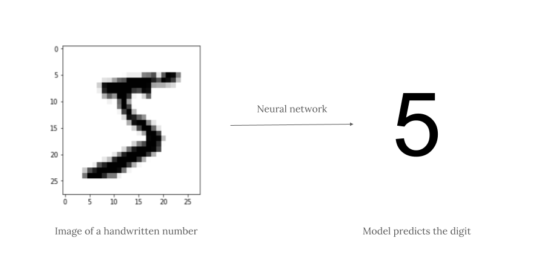

# Basic Image Classification with TensorFlow

The code presented in this repository applies the basics of using Keras with TensorFlow as the backend of a Neural Network model and uses it to predict digits from hand-written images with a high degree of accuracy.

 

  

 

---

### Updates

- January 11th, 2024: Project started and completed.
- January 27th, 2024: Public release of the code. 

### Further Information 

The code presented in this repository is an improved version of the guided project ["Basic Image Classification with TensorFlow"](https://www.coursera.org/projects/tensorflow-beginner-basic-image-classification) by Coursera Project Network.